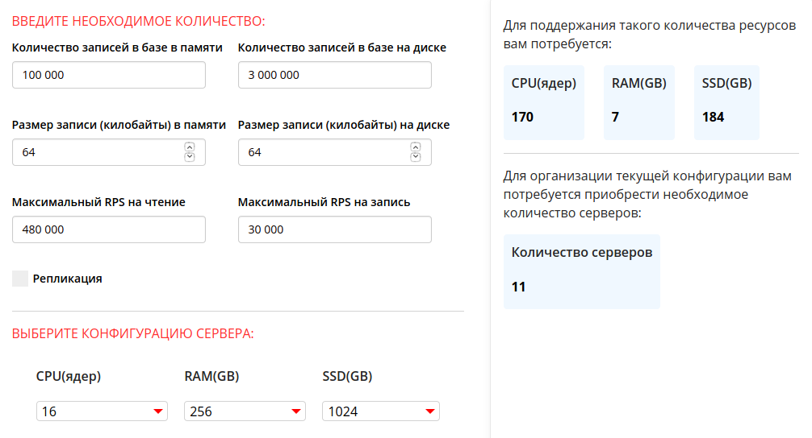

# HighLoadCoursework

## 1. Выбор темы

#### Система таргетинговой рекламы

Похожие сервисы: my target, РСЯ

*Требования*: быстро выдать рекламный контент web или мобильному клиенту, учитывая контекст (тематика ресурса, модель покупателя).

## 2. Определение возможного диапазона нагрузок

Для оценки диапазона нагрузок посмотрим на статистику My target и РСЯ

1. My target
    + Охват 96% пользователей рунета ([источник](https://target.my.com/))
    + В России количество интернет-пользователей, по данным Digital 2020, составило 118 миллионов ([источник](https://www.web-canape.ru/business/internet-2020-globalnaya-statistika-i-trendy/))
    + Итого 113 миллионов

2. РСЯ
    + На 2018 год охват в России 85 миллионов ([источник](https://yandex.ru/support/direct/general/yan.html]))
    + Учитывая динамику роста, предположим, что на 2020 год аудитория составляет 105 миллионов пользователей
    + Среднесуточная аудитория площадок РСЯ — более 85 миллионов пользователей

При проектировании системы предположим, что 70% рекламного контента будут составлять банеры, остальные 30% анимационная реклама.
Для определения веса объявления возьмем среднее значение из требований РСЯ — 150 КБ ([источник](https://yandex.ru/legal/banner_adv_rules/))

## 3. Выбор планируемой нагрузки

* Исходя из пункта 2
     + Общая аудитория — 100 миллионов пользователей (85% рунета)
     + Среднесуточная аудитория — 75 миллионов пользователей
     + Средний размер контента — 200 КБ
     + RPS — 200 000 (пик активности 400 000)
     + Нагрузка на статику RPS * вес объявления (без оверхеда протоколов, без сжатия) — 57,22 ГБ/с
     

## 4. Логическая схема базы данных

* В таблице advertiser логин и пароль для входа в запись, баланс профиля
* В таблице site логин и пароль конечного рекламораспространителя как юр лица

* Таблица banner 
    + static_link ссылка на файл объявления
    + is_activ - статус объявления (0 -  не активно, 1 - активно, 2 - на модерации, 3 - блокировка)
    + limit - ограничение показов
    + date_start/end - временное ограничение показов
    + target - ссылка на таргетинг

* Таблица target (таблица для таргетингов компании) 
     + theme - связь с таблицей тематик
     + gender - пол ЦА (0 - муж, 1 - жен, 3 - не важен)
     + age - возраст (битовая маска, движок поиска - BITSET)
     + geographic - связь с таблицей месторасположения
     + wealth - уровень обеспеченности (1-10, 11 - не важен)
    
    
* Таблица show_stat для сбора статистики по показам и переходам   

* Таблица show_stat_log для логов по показам

* Таблица users_uniq - это таблица для отслеживания уникальных пользователей.
Для определения уникального пользователя используется комбинация из ip, браузера или профиля на ресурсе
и параметров пользователя(см. таблица target). Дальше все эти параметры преобразуются в один массив байт и передаются в хеш функцию.
Хеш функцию стоит выбирать исходя из скорости её работы. Криптографическая стойкость роли не играет.
После получения хеша мы сравниваем с хешом id_hash в БД. При совпадении увеличиваем view_count для данного банера.
Если совпадения нет - добавляем запись.

* Таблица users хранит пользователей с их параметрами.

    
## 5. Физическая системы хранения

#### Данные о конечных рекламораспространителей и рекламодателей (PostgreSQL)
Для хранения этих данных я решил использовать PostgreSQL. Так как потеря этих данных для нас будет критической,
крайне важно выбрать БД с требованиями ACID. Стоит отметить, что данная база данных сильно
распространена и нам будет проще поддерживать и обеспечивать её работу. Еще отметим мощный механизм
репликации. 

#### Объявления, таргетинги, пользователи (Tarantool)
Для быстрой отдачи объявлений я решил использовать in-memory DB Tarantool. К главными
преимуществам БД стоит отнести скорость, возможность репликации и шардинга (фреймворк Cartridge 
упрощает реализацию и обеспечивает отказоустойчивость, переключаясь между серверами).
Данные объявления меняются крайне редко (процесс модерации объявления), нет 
необходимости часто экстренно синхронизовать реплики. Есть многокомпонентный индекс.
Шардинг по группам тематик. (Разделяем логически тематики так, чтобы группы тематик не комбинировались между собой)
Еще к плюсам можно отнести, что разработка данной БД идет в нашей стране.(дока-поддержка без перевода)

#### Статистика (ClickHouse)
Для аналитических запросов я выбрал ClickHouse. Данная БД используется в Яндекс Метрике, Директе.
Сейчас для аналитики представлена упрощенная модель. Добавление в аналитические данные:
записей об каждой отображенном объявлении, логов и тд, создаст огромную БД, для которой будет крайне важно
колоночное хранение, которое экономит место за счёт сжатия данных.
Еще к плюсам можно отнести линейную масштабируемость и тот факт, что данные записываются пачками.
Для статистики нам не нужна строгая резкая репликация, нам подойдет асинхронная репликация из ClickHouse.

Статические файлы (bundle.js, index.html, css, все объявления хранятся на отдельных серверах со статикой - nginx)

## 6. Выбор прочих технологий

#### Архитектура

Микросервисная. Причины:

* Удобство разработки (команда на каждый сервис)
* Стабильность из-за независимости (сбои в одном сервисе не повлияют на другой)
* Маштабируемость отдельного сервиса, а не всей системы (можем маштабировать отельный сервис)
* Удобство разработки на разных языках

#### Выделим 3 сервиса

* Сервис для управления - данный сервис предлагает инструменты управления для рекламодателей, конечных
рекламораспространителей. 

* Сервис объявлений - сервис для быстрой выдачи объявления по входящим параметрам.

* Сервис статистики - сервис для сбора статистики и логов по объявлениям.

#### Взаимодействие между микросервисами

* Сервис для управления ( для рекламодателей / конечных распространителей). Основные функции:
    * Регистрация рекламодателя / площадки распространения. Создается запись в таблице advertiser / site.
    Обращение к БД Postgres.
    * Создание таргетинга  Создается запись в таблице target. Обращение к Tarantool.
    * Создание объявлений. Создается запись в таблице banner. Обращение к Tarantool.
    * Управление объявлением. Покупка limit у banner за balance. Обращение к Tarantool.
    * Интерфейс для просмотра статистики. Интерфейс фильтров для запросов к ClickHouse. 

    
* Сервис объявлений
    * Выдача объявлений. После чтения параметров запроса выполняется обращение к Tarantool с целью найти необходимое
    объявление. Для определения "подходит ли нам это объявление" используется таблица target,
    которая связана с banner.target.
    * Отправка статистики. Строго после ответа конечному распространителю
    выполняется запрос к ClickHouse. Запрос представляет собой лог происходящего и состоит из:
    время отдачи объявления, id_объявления, id_таргетинга, advertiser_id, id_site. 
    
* Сервис статистики
    * Сбор статистики. Предоставляет api для принятия статистики для сервиса объявлений.
    После принятия запроса выполняется запись лога в ClickHouse. Логи записываются в таблицу show_stat_log.
    Для улучшение скорости работы  добавим отдельную таблицу - show_stat (объявления, инкремент показов и другие агрегаты).
    Запись в таблицу show_stat будет производиться не на каждый приходящий лог, а при выполнении скрипта каждые 10 минут.
    Отметим, что за недостающей информацией сервис статистики может обратиться к БД Tarantool, в которой хранятся
    таргетинги и объявления. Пример: Пришла запись с id_таргетинга, которого нет в ClickHouse. Сервис статистики
    делает запрос к Tarantool для получения детальной информации о таргетинге по его id. Записывает информацию
    о таргетинге и больше не спрашивает Tarantool по-данному таргетингу.
    * show_stat.uniq_view_count обновляется также раз в 10 минут из таблицы users_uniq
    * Предоставление статистики. Предоставляет api для выдачи статистики для сервиса управления.
    api способно обработать различные фильтры от сервиса управления и предоставить результат.      
     

#### Языки программирования

* Сервис для управления и сервис статистики - Golang. Golang - современный, развивающийся язык, который заточен под
серверную разработку. К основным плюсам стоит отнести: скорость разработки (сравнение с С++),
встроенную многопоточность, мощную concurrency, популярность языка, возможности стандартной библиотеки.
Еще к плюсам Golang можно отнести встроенные возможности по тестированию и форматированию кода.   

* Сервис объявлений - C++. Для сервиса объявлений я бы выбрал Golang, но есть одно НО - garbage collector.
Одно из основных требований к сервису - скорость отдачи объявления.
Данное требование затрагивает только сервис объявлений. Если бы не было жестких требований по времени отдачи объявления,
я бы выбрал Golang, но автоматическое освобождение памяти может нарушить требование по времени.
Для ускорения процесса разработки можно использовать исходный код Nginx, добавив логику выбора объявления.

#### Протоколы взаимодействия

* Для взаимодействия между клиентом и сервером будем использовать https. 
* Передача данных между клиентом и сервером - json (распространенность, много библиотек).
* Передача данных между микросервисами - protobuf. (скорость, заранее обговариваем структуры для передачи)
* На стороне клиента - html, css, js. (+ получатели объявления могут являться моб клиентами)

## 7. Расчет нагрузки и потребного оборудования

#### Определим 6 основных типа серверов

* Бэк объявлений(C++)
* Бэк для рекламодателя/площадки(Go)
* БД для рекламодателя/площадки(Postgres)
* БД для подбора объявления(Tarantool)
* БД для хранения пользователи с таргетингами(Tarantool)
* БД для сессий рекламодателей/площадки(Redis)

* Бэк для выдачи объявлений/БД для подбора объявления

Мощность бэка для рекламодателя/площадки составляет 1/20 бэка для выдачи объявлений

* Postgres

* Бэк для хранения сессий рекламодателей/площадки

* БД хранение статистики

####  Расчет нагрузки

Для расчета нагрузки обозначим, что нам необходимо иметь 20% запас RPS от максимального
значения в течение дня.

RPS: 480 000

* Бэк отдача объявлений: 12шт 40 ядерных серверов (1000 RPS на ядро, требуется 480 000)

* БД для рекламодателя/площадки: 3 64-ти поточных серверов (master и 2 slave)

* Бэк рекламодателя/площадки: 3 16-ти поточных сервера

* БД для подбора объявления: 111 32-ти ядерных сервера (данные помещаются в памяти, 136  RPS в тестах на 200к записей
таргет-объявление) В каждом сервере 32 тарантула

* БД для хранения пользователей с таргетингами: 13 16-ти ядерных сервера (RAM(GB) = 1024; SSD(TB)=4) + 13 шт на реплику.
Для 85 000 000 на диске, 31 000 000 в памяти, RPS = 480 000. Размер записи - 128КБ. [Калькулятор](https://www.tarantool.io/ru/sizing_calculator/)
+ 13шт на реплику. 13 Шардды по id_hash % (кол-во шардов * кол-во ядер в тачке). RPS нагрузки по индексу 1 млн = 103873.

* БД для сессий рекламодателей/площадки(Redis): 1 16-ти поточный сервер

* Nginx: 12 32-поточных серверов (6 - для статики, 4 для подбора объявления + балансировщик на шарды Tarantool, шарды для таблицы пользователей)

* Для обеспечения отказоустойчивости необходимо иметь готовые сервера, которые могут заменить упавшие рабочие.
Для каждого типа запасаем +1 сервер с таким же железом и готовым ПО.

#### Алгоритмическая сложность запроса Tarantool, пропускная способность
В БД мы используем btree индексы и производим поиск за log2(N).
Выборка из активных log2(100 000) =~ 17.
Максимальное кол-во поисков 6 (5 - параметры таргетинга, 1 поиск баннера).
Итого 102 (17*6) сравнения при поиске.
Для памяти с эффективной частотой 3200 МГц максимальная пропускная способность составит 3200 × 8 = 25 600 МБ/c
Предположим средний размер записи, учитывая:

* id int - 8
* advertiser_id int - 8
* theme int - 8
* gender int - 8
* age int - 8
* geographic int - 8
* wealth int - 8
Итого длина записи 56 байт.
Индекс на одну запись 8 байт * 6 полей = 48 байт.

Максимальное кол-во байт для чтения индекса таргетинга = 48 * 102 = 4896 байт. (0,0047 МБ)
Для 400 000 PRS - 1 880 МБ. Теоретически нам хватает пропускной способности памяти, но тут были посчитаны
только индексы, не учитывается время сравнения при поиске, еще отметим что пропускная способность памяти в 25 600 МБ/c не всегда достижима.

Сделан вывод, что для достаточно приблизительного ответа на вопрос о нагрузке Tarantool необходимо поднять
собственный тестовый стенд с боевой конфигурацией и боевым размером данных. Для определения кол-ва серверов
воспользуемся [калькулятором](https://www.tarantool.io/ru/sizing_calculator/)
 

Выбрать можно было только 16 ядер. Для нашей конфигурации будем использовать 32 ядерные процессоры, 6 штук. 

## 8. Выбор хостинга / облачного провайдера и расположения серверов

Для хостинга я выбрал Яндекс.cloud. Причины:

* Расположение ЦОД, Московская область
* Известность Яндекс (не какой-то новый левый хостинг, в этих же ЦОДах работает сам Яндекс)
* Можем хранить персональные данные (Yandex.Cloud соответствует требованиям ФЗ-152)
* Защита от DDoS ([источник](https://cloud.yandex.ru/services/ddos-protection))
* OpenVPN Access Server - готовый VPN сервер ([источник](https://cloud.yandex.ru/marketplace/products/f2e1aee242rtv6lsrfea))
* Managed Service for ClickHouse ([источник](https://cloud.yandex.ru/services/managed-clickhouse))
* Kubernetes ([источник](https://cloud.yandex.ru/services/managed-kubernetes))

## 9. Схема балансировки нагрузки (входящего трафика и внутрипроектного, терминация SSL)

#### DNS

* DNS. Укажем несколько IP в А записях.
Отметим, что в случае отказа бэка, все запросы будут отправляться к нему из-за dns кеша. 

* Запросы к nginx серверам будут поступать по алгоритму Round Robin.
* Для обеспечения отказоустойчивости необходимо отработать механизм поднятия сервера nginx c сохранением
ip упавшего сервера.
* После балансировки DNS запросы балансируются L7 балансировщиком на самих nginx серверах.

#### nginx

* nginx(L7). Плюс данного решения в том, что мы сможем
использовать уже реализованные механизмы балансировки. Так как бэкенды для отдачи объявления будут одинаковые по
характеристикам, то будем использовать алгоритм балансировки round-robin,
без весов - одинаковые сервера у каждого типа серверов. Еще к плюсам nginx можно отнести
распространенность, http2, ssl (от nginx до бэка трафик не будет шифроваться) 

* Поток трафика клиентов будут обрабатывать nginx сервера, которые будут проксировать запросы на сервисы.
* Запросы после прохождения nginx передаются без ssl.
* Все микросервисы недоступны в открытой сети Интернет.
* Микросервисы работают в VPN (Openvpn - из-за распространенности)
* Бэкенд считается упавшим, если за 10 секунд произошло 2 и более ошибки ( max_fails=2 fail_timeout=10s). Необходимо
найти модуль на nginx или написать скрипт, который будет уведомлять дежурных сотрудников о сбое.

* Рабочий nginx балансировщик опрашивается зарезервированными nginx сервером, при отсутствии пинга(3 подряд) зарезервированный сервер
заменяет упавший. При наличии нескольких зарезервированных nginx необходимо назначить им приоритет. При замене необходимо сохранить
IP упавшего.

## 10. Обеспечение отказоустойчивости

#### Основные моменты

* Начать обеспечение отказоустойчивости стоит с проверки требований к системе на стадии планирования архитектуры и ТЗ.
Стоимость выявления ошибок на этой стадии минимальная.
* CI (на каждый коммит разработчика запускаются тесты и линтер)
* Code review
* Обеспечения достаточного логирования (request id назначается на nginx)
* Перед каждым релизом версии проверять [Яндекс танком](https://yandex.ru/dev/tank/)
* Установка timeout nginx (99% всех запросов)
* Согласование внештатных ситуаций с облачным провайдером (DDos, физ повреждения и тд)
* Prometheus, Grafana, собственные дашборды, node exporter, уведомления дежурных сотрудников обеспечат нас
средствами мониторинга
* Статические файлы объявлений, которые раздает nginx, находятся  заранее в жатом формате. (nginx не тратит время на сжатие)
* Установка rate лимитов на api. (limit_req_zone rate=15r/m)
* Необходимо заранее отработать ситуацию автоматического поднятия сервера на смену упавшему (заранее имеем готовую железку).
Серверу, который начала работать вместо старого, необходимо выдать ip упавшего сервера - необходимое условие для dns балансировки. 
* Замена на DDR5 при выходе стандарта на глобальный рынок. Ключевой элемент системы напрямую зависит от скорости работы с памятью.
 
 
