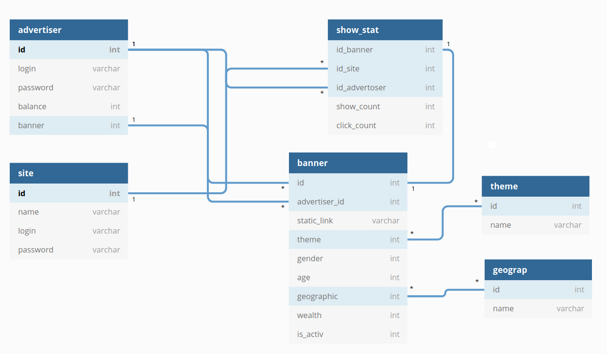
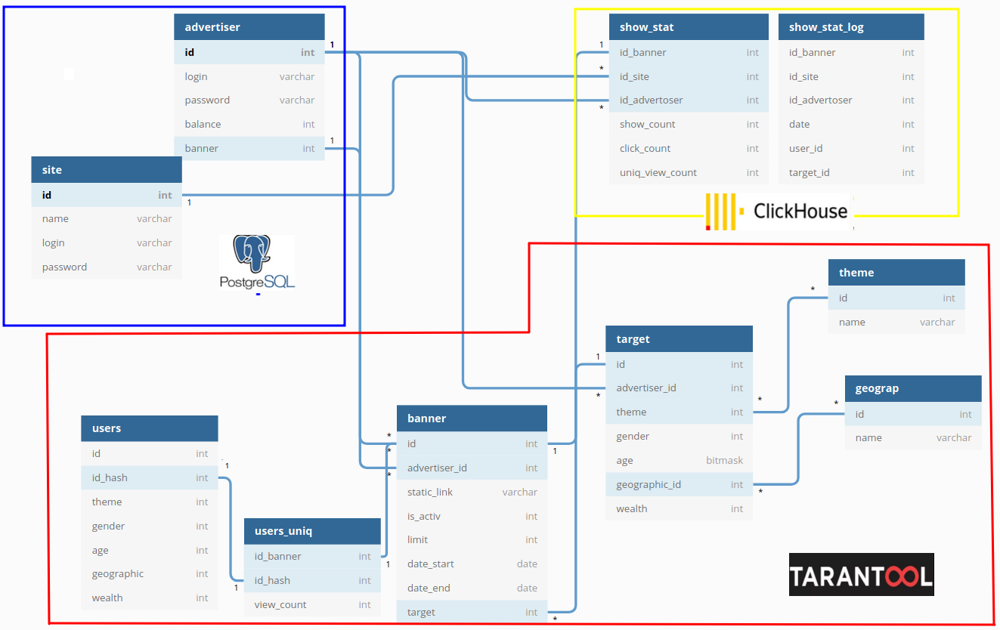
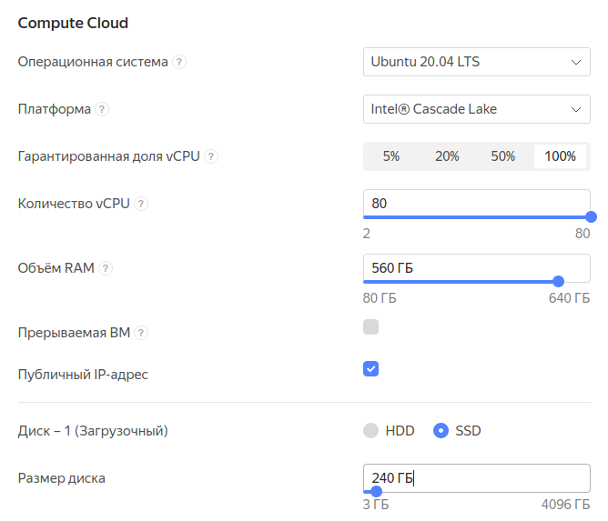
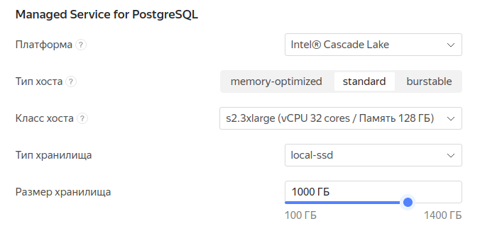
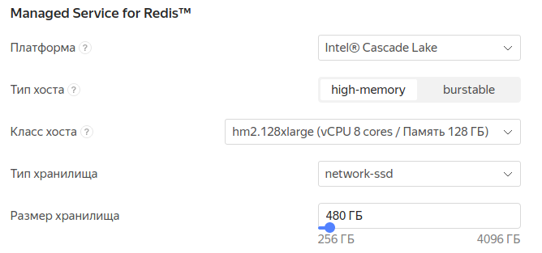
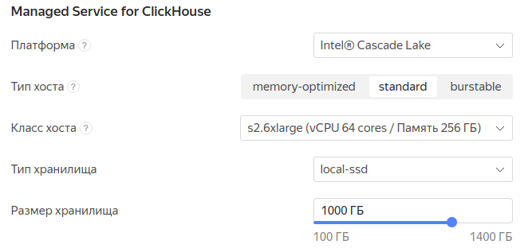

# HighLoadCoursework

## 1. Выбор темы

#### Система контекстной рекламы

Похожие сервисы: my target, РСЯ

*Требования*: быстро выдать рекламный контент web или мобильному клиенту, учитывая контекст (тематика ресурса, модель покупателя).

## 2. Определение возможного диапазона нагрузок

Для оценки диапазона нагрузок посмотрим на статистику My target и РСЯ

1. My target
    + Охват 96% пользователей рунета ([источник](https://target.my.com/))
    + В России количество интернет-пользователей, по данным Digital 2020, составило 118 миллионов ([источник](https://www.web-canape.ru/business/internet-2020-globalnaya-statistika-i-trendy/))
    + Итого 113 миллионов

2. РСЯ
    + На 2018 год охват в России 85 миллионов ([источник](https://yandex.ru/support/direct/general/yan.html]))
    + Учитывая динамику роста, предположим, что на 2020 год аудитория составляет 105 миллионов пользователей
    + Среднесуточная аудитория площадок РСЯ — более 85 миллионов пользователей

При проектировании системы предположим, что 70% рекламного контента будут составлять банеры, остальные 30% анимационная реклама.
Для определения веса объявления возьмем среднее значение из требований РСЯ — 150 КБ ([источник](https://yandex.ru/legal/banner_adv_rules/))

## 3. Выбор планируемой нагрузки

* Исходя из пункта 2
     + Общая аудитория — 100 миллионов пользователей (85% рунета)
     + Среднесуточная аудитория — 75 миллионов пользователей
     + Средний размер контента — 200 КБ
     + RPS — 2000 (уточнял на сдачи ДЗ 3)
     + request per day — 172 800 000
     + Нагрузка на статику RPS * вес объявления (без оверхеда протоколов) — 0.3 ГБ/с
     

## 4. Логическая схема базы данных

* В таблице advertiser логин и пароль для входа в запись, баланс профиля
* В таблице site логин и пароль конечного рекламораспространителя как юр лица

* Таблица banner 
    + static_link ссылка на файл объявления
    + theme - связь с таблицей тематик
    + gender - пол ЦА (0 - муж, 1 - жен, 3 - не важен)
    + age - возраст (заранее определенный id для возраста или комбинаций возрастов)
    + geographic - связь с таблицей месторасположения
    + wealth - уровень обеспеченности (1-10, 11 - не важен)
    + is_activ - статус объявления (0 -  не активно, 1 - активно, 2 - на модерации, 3 - блокировка)
    + Данная таблица может дополниться новыми необходимыми параметрами для объявления, url для перехода.
    
    
* Таблица show_stat для сбора статистики по показам и переходам   
    
## 5. Физическая системы хранения

#### Данные о конечных рекламораспространителей и рекламодателей (PostgreSQL)
Для хранения этих данных я решил использовать PostgreSQL. Так как потеря этих данных для нас будет критической,
крайне важно выбрать БД с требованиями ACID. Стоит отметить, что данная база данных сильно
распространена и нам будет проще поддерживать и обеспечивать её работу. Еще отметим мощный механизм
репликации. 

#### Объявления и параметры объявлений (Tarantool)
Для быстрой отдачи объявлений я решил использовать in-memory DB Tarantool. К главными
преимуществам БД стоит отнести скорость, возможность репликации и шардинга (фреймворк Cartridge 
упрощает реализацию и обеспечивает отказоустойчивость, переключаясь между серверами).
Данные объявления меняются крайне редко (процесс модерации объявления), нет 
необходимости часто экстренно синхронизовать реплики.
Шардинг по группам тематик. (Разделяем логически тематики так, чтобы группы тематик не комбинировались между собой)
Еще к плюсам можно отнести, что разработка данной БД идет в нашей стране.(дока-поддержка без перевода)

#### Статистика (ClickHouse)
Для аналитических запросов я выбрал ClickHouse. Данная БД используется в Яндекс Метрике, Директе.
Сейчас для аналитики представлена упрощенная модель. Добавление в аналитические данные:
записей об каждой отображенном объявлении, логов и тд, создаст огромную БД, для которой будет крайне важно
колоночное хранение, которое экономит место за счёт сжатия данных.
Еще к плюсам можно отнести линейную масштабируемость и тот факт, что данные записываются пачками.
Для статистики нам не нужна строгая резкая репликация, нам подойдет асинхронная репликация из ClickHouse.

Статические файлы (bundle.js, index.html, css, все объявления хранятся на отдельном сервере со статикой - nginx)

## 6. Выбор прочих технологий

#### Архитектура

Микросервисная. Причины:

* Удобство разработки (команда на каждый сервис)
* Стабильность из-за независимости (сбои в одном сервисе не повлияют на другой)
* Маштабируемость отдельного сервиса, а не всей системы (можем маштабировать отельный сервис)
* Удобство разработки на разных языках

#### Выделим 3 сервиса

* Сервис для управления - данный сервис предлагает инструменты управления для рекламодателей, конечных
рекламораспространителей. 

* Сервис объявлений - сервис для быстрой выдачи объявления по входящим параметрам.

* Сервис статистики - сервис для сбора статистики и логов по объявлениям.

#### Языки программирования

* Сервис для управления и сервис статистики - Golang. Golang - современный, развивающийся язык, который заточен под
серверную разработку. К основным плюсам стоит отнести: скорость разработки (сравнение с С++),
встроенную многопоточность, мощную concurrency, популярность языка, возможности стандартной библиотеки.
Еще к плюсам Golang можно отнести встроенные возможности по тестированию и форматированию кода.   

* Сервис объявлений - C++. Для сервиса объявлений я бы выбрал Golang, но есть одно НО - garbage collector.
Одно из основных требований к сервису - скорость отдачи объявления.
Данное требование затрагивает только сервис объявлений. Если бы не было жестких требований по времени отдачи объявления,
я бы выбрал Golang, но автоматическое освобождение памяти может нарушить требование по времени.
Для ускорения процесса разработки можно использовать исходный код Nginx, добавив логику выбора объявления.

#### Протоколы взаимодействия

* Для взаимодействия между клиентом и сервером будем использовать https. 
* Передача данных между клиентом и сервером - json (распространенность, много библиотек).
* Передача данных между микросервисами - protobuf. (скорость, заранее обговариваем структуры для передачи)
* На стороне клиента - html, css, js. (+ получатели объявления могут являться моб клиентами)

#### Отложенное выполнение для оптимизации
Стоит дополнительно описать процесс подбора-выдачи объявления: при поступлении запроса упор делается 
на скорость ответа. Сразу после подбора объявления оно отдается запросившему и сокет с запросившем клиентом закрывается.
Только после этого выполняется запись о происходящем в сервис для статистики.

## 7. Расчет нагрузки и потребного оборудования

#### Определим 5 основных типа серверов

* Бэк объявлений(C++)
* Бэк для рекламодателя/площадки(Go)
* БД для рекламодателя/площадки(Postgres)
* БД для подбора объявления(Tarantool)
* БД для сессий рекламодателей/площадки(Redis)

* Бэк для выдачи объявлений

Мощность бэка для рекламодателя/площадки составляет 1/4 бэка для выдачи объявлений

* Postgres

* Бэк для хранения сессий рекламодателей/площадки

* БД хранение статистики

####  Расчет нагрузки

Как понять общий RPS на объявления? 2000(спрашивал на сдаче дз) это же мало

Сколько  будет выдавать моя конфигурация? (Бэк для выдачи объявлений)

## 8. Выбор хостинга / облачного провайдера и расположения серверов

Для хостинга я выбрал Яндекс.cloud. Причины:

* Расположение ЦОД, Московская область
* Известность Яндекс (не какой-то новый левый хостинг, в этих же ЦОДах работает сам Яндекс)
* Можем хранить персональные данные (Yandex.Cloud соответствует требованиям ФЗ-152)
* Защита от DDoS ([источник](https://cloud.yandex.ru/services/ddos-protection))
* OpenVPN Access Server - готовый VPN сервер ([источник](https://cloud.yandex.ru/marketplace/products/f2e1aee242rtv6lsrfea))
* Managed Service for ClickHouse ([источник](https://cloud.yandex.ru/services/managed-clickhouse))
* Kubernetes ([источник](https://cloud.yandex.ru/services/managed-kubernetes))

## 9. Схема балансировки нагрузки (входящего трафика и внутрипроектного, терминация SSL)

* Для балансировки будем использовать nginx(L7). Плюс данного решения в том, что мы сможем
использовать уже реализованные механизмы балансировки. Так как бэкенды для отдачи объявления будут одинаковые по
характеристикам, то будем использовать алгоритм балансировки round-robin. Еще к плюсам nginx можно отнести
распространенность, http2, ssl (от nginx до бэка трафик не будет шифроваться) 

* Поток трафика клиентов будут обрабатывать nginx сервера, которые будут проксировать запросы на сервисы.
* Запросы после прохождения nginx передаются без ssl.
* Все микросервисы недоступны в открытой сети Интернет.
* Микросервисы работают в VPN (Openvpn - из-за распространенности)

## 10. Обеспечение отказоустойчивости

#### Основные моменты

* Начать обеспечение отказоустойчивости стоит с проверки требований к системе на стадии планирования архитектуры и ТЗ.
Стоимость выявления ошибок на этой стадии минимальная.
* CI (на каждый коммит разработчика запускаются тесты и линтер)
* Code review
* Обеспечения достаточного логирования (request id назначается на nginx)
* Перед каждым релизом версии проверять [Яндекс танком](https://yandex.ru/dev/tank/)
* Установка timeout nginx (99% всех запросов)
* Согласование внештатных ситуаций с облачным провайдером (DDos, физ повреждения и тд)
* Prometheus, Grafana, собственные дашборды, node exporter, уведомления дежурных сотрудников обеспечат нас
средствами мониторинга 