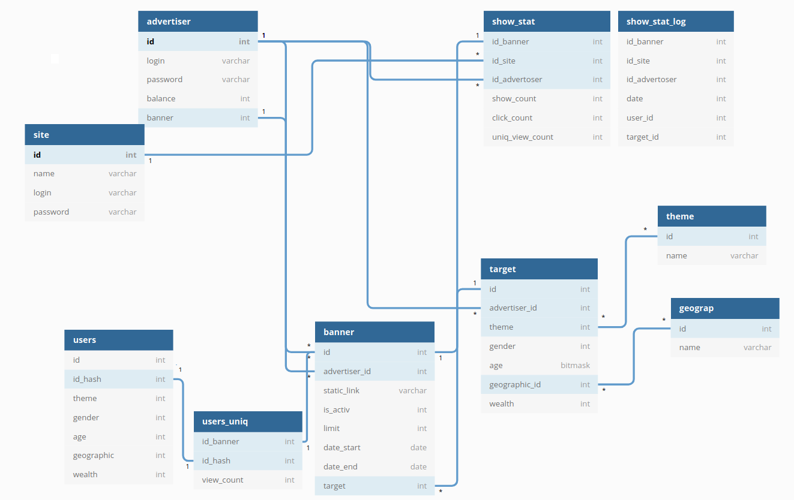

# HighLoadCoursework

## 1. Выбор темы

#### Система контекстной рекламы

Похожие сервисы: my target, РСЯ

*Требования*: быстро выдать рекламный контент web или мобильному клиенту, учитывая контекст (тематика ресурса, модель покупателя).

## 2. Определение возможного диапазона нагрузок

Для оценки диапазона нагрузок посмотрим на статистику My target и РСЯ

1. My target
    + Охват 96% пользователей рунета ([источник](https://target.my.com/))
    + В России количество интернет-пользователей, по данным Digital 2020, составило 118 миллионов ([источник](https://www.web-canape.ru/business/internet-2020-globalnaya-statistika-i-trendy/))
    + Итого 113 миллионов

2. РСЯ
    + На 2018 год охват в России 85 миллионов ([источник](https://yandex.ru/support/direct/general/yan.html]))
    + Учитывая динамику роста, предположим, что на 2020 год аудитория составляет 105 миллионов пользователей
    + Среднесуточная аудитория площадок РСЯ — более 85 миллионов пользователей

При проектировании системы предположим, что 70% рекламного контента будут составлять банеры, остальные 30% анимационная реклама.
Для определения веса объявления возьмем среднее значение из требований РСЯ — 150 КБ ([источник](https://yandex.ru/legal/banner_adv_rules/))

## 3. Выбор планируемой нагрузки

* Исходя из пункта 2
     + Общая аудитория — 100 миллионов пользователей (85% рунета)
     + Среднесуточная аудитория — 75 миллионов пользователей
     + Средний размер контента — 200 КБ
     + RPS — 2000 (уточнял на сдачи ДЗ 3)
     + request per day — 172 800 000
     + Нагрузка на статику RPS * вес объявления (без оверхеда протоколов) — 0.3 ГБ/с
     

## 4. Логическая схема базы данных

* В таблице advertiser логин и пароль для входа в запись, баланс профиля
* В таблице site логин и пароль конечного рекламораспространителя как юр лица

* Таблица banner 
    + static_link ссылка на файл объявления
    + theme - связь с таблицей тематик
    + gender - пол ЦА (0 - муж, 1 - жен, 3 - не важен)
    + age - возраст (заранее определенный id для возраста или комбинаций возрастов)
    + geographic - связь с таблицей месторасположения
    + wealth - уровень обеспеченности (1-10, 11 - не важен)
    + is_activ - статус объявления (0 -  не активно, 1 - активно, 2 - на модерации, 3 - блокировка)
    
* Таблица show_stat для сбора статистики по показам и переходам   
    
## 5. Физическая системы хранения

#### Данные о конечных рекламораспространителей и рекламодателей (PostgreSQL)
Для хранения этих данных я решил использовать PostgreSQL. Так как потеря этих данных для нас будет критической,
крайне важно выбрать БД с требованиями ACID. Стоит отметить, что данная база данных сильно
распространена и нам будет проще поддерживать и обеспечивать её работу. Еще отметим мощный механизм
репликации.

#### Объявления и параметры объявлений (Tarantool)
Для быстрой отдачи объявлений я решил использовать in-memory DB Tarantool. К главными
преимуществам БД стоит отнести скорость, возможность репликации и шардинга (фреймворк Cartridge 
упрощает реализацию и обеспечивает отказоустойчивость, переключаясь между серверами).
Данные объявления меняются крайне редко (процесс модерации объявления), нет 
необходимости часто экстренно синхронизовать реплики.
!!!Шардинг по строгому географическому параметру. (мск и область упрется =( ))!!!
Еще к плюсам можно отнести, что разработка данной БД идет в нашей стране.(дока-поддержка без перевода)

#### Статистика (ClickHouse)
Для аналитических запросов я выбрал ClickHouse. Данная БД используется в Яндекс Метрике, Директе.
Сейчас для аналитики представлена упрощенная модель. Добавление в аналитические данные:
записей об каждой отображенном объявлении, логов и тд, создаст огромную БД, для которой будет крайне важно
колоночное хранение, которое экономит место за счёт сжатия данных.
Еще к плюсам можно отнести линейную масштабируемость и тот факт, что данные записываются пачками.
Для статистики нам не нужна строгая резкая репликация, нам подойдет асинхронная репликация из ClickHouse.

хост  - Managed Service for ClickHouse

## 6. Выбор прочих технологий

* Объявления с++

* Рекламодатель и рекламораспространитель Go

* Статистика Go

## 7. Расчет нагрузки и потребного оборудования

## 8. Выбор хостинга / облачного провайдера и расположения серверов

## 9. Схема балансировки нагрузки (входящего трафика и внутрипроектного, терминация SSL)

## 10. Обеспечение отказоустойчивости

